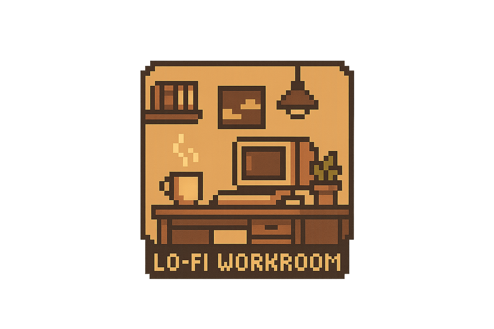
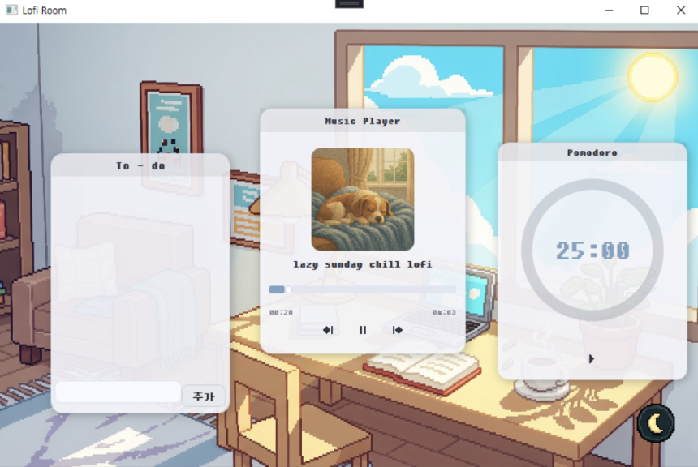
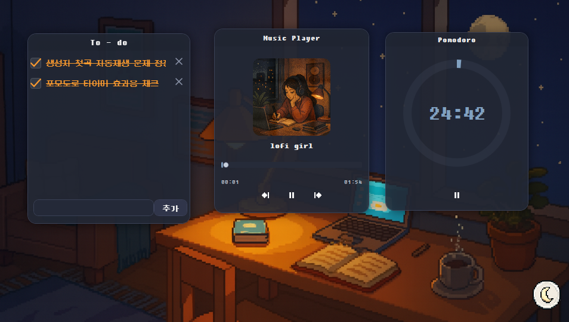

# Lofi_Workroom

---

##  프로젝트 한눈에 보기
C#과 WPF를 5일 만에 집중 학습하며 **AI Vibe Coding**으로 완성한 앱 입니다. 새로운 기술 스택에 대한 도전을 기록합니다.
**Lofi Workroom**은 개발자 및 생산성을 필요로 하는 사용자를 위해 설계된 올인원(All-in-One) 데스크톱 애플리케이션입니다.
  
개인 작업을 위한 최적의 **집중 공간**을 제공하며, 로파이 감성을 담은 위젯 시스템을 통해 사용자의 작업 효율을 극대화하는 것을 목표로 합니다.
  
---

##  프로젝트 미리보기 (Screenshots)
 

  

  
  ### 라이트 모드 (Light Mode)
  
  
  ### 다크 모드 (Dark Mode)
  

## 주요 기능
Lofi Workroom은 사용자 정의가 가능한 다양한 위젯을 제공하여 작업 효율을 높입니다.
  
### 1. 포모도로 타이머
* **주기 설정:** 25분 집중 + 5분 휴식 주기를 기본으로 설정합니다.
* **시각적 피드백:** 시간을 직관적으로 보여주는 원형 프로그레스 링 애니메이션을 제공합니다.

### 2. Todo 리스트 (할 일 관리)
* **CRUD 지원:** 할 일 추가, 완료 처리, 삭제 등 기본적인 할 일 관리가 가능합니다.
* **데이터 지속성:** SQLite를 기반으로 데이터를 저장하여 앱을 재시작해도 목록이 유지됩니다.

### 3. 위젯 시스템
* **자유 배치:** 모든 위젯은 드래그 앤 드롭으로 데스크톱 화면에서 자유롭게 배치할 수 있습니다.
* **모듈화:** 스티커 메모처럼 여러 위젯을 조합하여 자신만의 작업 환경을 구축할 수 있습니다.

### 4. 테마 전환
* **라이트/다크 모드:** 버튼 클릭 한 번으로 즉시 라이트 모드와 다크 모드를 전환할 수 있습니다.
* **통합 테마:** 테마 전환 시 모든 위젯의 색상 팔레트가 함께 변경되어 일관성을 유지합니다.

---
## 개발환경
- DB: SQLite
- GUI: WPF (C#)
- OS: Windows 10
- IDE: Visual Studio 2022
---
## 기술 스택 (Tech Stack)
| 구분 | 기술 | 설명 |
| :--- | :--- | :--- |
| **GUI/프레임워크** | C#, WPF | 윈도우 데스크톱 애플리케이션 개발 |
| **데이터베이스** | SQLite | 로컬 환경에서 사용자 데이터(Todo 등) 저장 및 관리 |
| **개발 환경** | Visual Studio 2022 | 개발 IDE |
| **운영체제** | Windows 10+ | 대상 플랫폼 |
